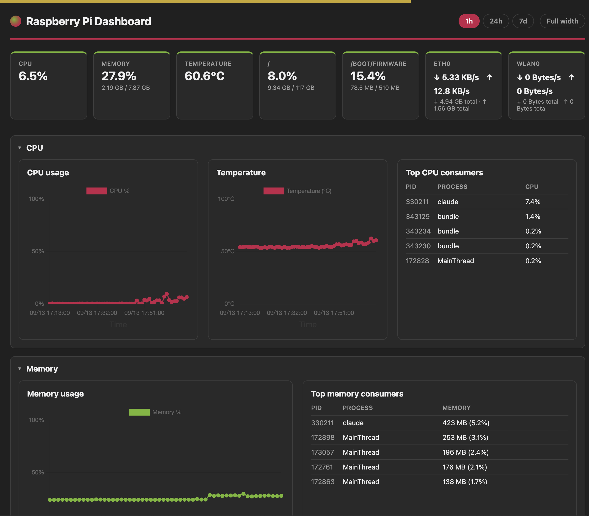

# Pi Stats Dashboard

A self-hosted Ruby on Rails dashboard for monitoring a Raspberry Pi (or any
Linux box): current and historical CPU, memory, disk, network, and
temperature stats, with interactive charts, backed by SQLite. No external
services required — everything runs in a single process.



## Features

- **Live tiles** for CPU, memory, temperature, every mounted filesystem, and
  every network interface
- **Interactive historical charts** (1h / 24h / 7d) for the same metrics,
  grouped into collapsible CPU / Memory / Disk / Networking sections
- **Top 5 processes by CPU and by memory usage**
- **A synced crosshair** across every chart on hover, for spotting
  correlated spikes (e.g. a CPU spike lining up with a network spike)
- **Auto-refreshing** dashboard (with a visual countdown to the next
  refresh) so it stays current on a wall-mounted display or a pinned tab
- Raspberry-Pi-inspired theme with light/dark mode support, responsive down
  to phone width
- A footer with basic host info (board model, OS, kernel, hostname)

## Tech stack

- Ruby 3.4 / Rails 8
- SQLite (via Rails 8's multi-database setup: primary, cache, queue, cable)
- [Solid Queue](https://github.com/rails/solid_queue) for scheduled
  background polling — no Redis/Sidekiq needed
- [Chartkick](https://chartkick.com) + Chart.js for charts, vendored locally
  via importmap (no Node build step, works fully offline on your LAN)
- Plain CSS (no Tailwind/Sass) and a couple of small Stimulus controllers
  for the auto-refresh, full-width toggle, and chart crosshair

## How it works

Stats are collected by parsing `/proc/stat`, `/proc/meminfo`,
`/proc/net/dev`, and `/sys/class/thermal/thermal_zone0/temp` directly, plus
shelling out to `df` (disk usage) and `ps` (top processes) — see
`app/services/stats/`. A recurring Solid Queue job
(`StatsPollJob`, `config/recurring.yml`) takes a snapshot every 60 seconds;
CPU% and network throughput are computed as deltas between successive
snapshots, since `/proc` only exposes cumulative counters. A second
recurring job (`StatsPruneJob`) deletes snapshots older than 7 days so the
database stays bounded. Both intervals are easy to change — see
[Configuration](#configuration).

`app/queries/stats/dashboard_query.rb` is the single place that reads stats
back out for display, kept separate from the controller so a future JSON
API could reuse it without duplicating query logic.

## Requirements

- Ruby 3.4+ (see `.ruby-version`)
- Linux (reads from `/proc` and `/sys`; `vcgencmd` is used as a fallback for
  temperature on Raspberry Pi OS specifically, but the sysfs thermal zone
  works on any Linux host)
- SQLite 3

## Getting started

```sh
git clone <this-repo> pi-dashboard
cd pi-dashboard
bundle install
bin/rails db:prepare
bin/rails server
```

Then visit `http://localhost:3000`. In development, `config/recurring.yml`
polls every 60 seconds, so the charts will start filling in within a
minute or two.

## Configuration

Everything is configured through plain constants/env vars rather than a
settings UI:

| What | Where |
|---|---|
| Poll interval / retention window | `config/recurring.yml` (schedule) and `StatsPruneJob::RETENTION` |
| Available time ranges (1h/24h/7d) | `DashboardController::RANGES` |
| Port | `PORT` env var (defaults to 3000 — chosen so it doesn't collide with services like Pi-hole on port 80) |
| Puma thread count | `RAILS_MAX_THREADS` env var |
| Run Solid Queue's supervisor inside Puma (single-process deploy) | `SOLID_QUEUE_IN_PUMA=true` |

## Running the test suite

```sh
bundle exec rspec
```

Reader specs stub `/proc`/`df`/`ps` output so they run identically on any
machine; `Stats::SnapshotCollector` specs cover the delta math (including
the first-poll-ever and counter-reset edge cases).

## Deployment

This app is designed to run as a single Puma process (Solid Queue's
supervisor embedded via `SOLID_QUEUE_IN_PUMA=true`) under systemd — not in a
container; see below.

The single-command path, from a fresh clone:

```sh
bundle install
bin/setup_server
```

`bin/setup_server` asks for the system user/group to run as and the path
the repo lives at (defaulting to whatever it detects), then handles
everything else: generating fresh credentials if `config/master.key` isn't
present (it's gitignored — the `credentials.yml.enc` committed to this repo
was encrypted with the original author's key, which nobody else has),
preparing the production database, precompiling assets, and installing +
starting the systemd service from `deploy/pi-dashboard.service.example`.
It's safe to re-run any time (e.g. after a Ruby upgrade, or to pick up a
`git pull`).

To do it by hand instead, fill in the `{{PLACEHOLDERS}}` in
`deploy/pi-dashboard.service.example` and:

```sh
RAILS_ENV=production bin/rails db:prepare
RAILS_ENV=production bin/rails assets:precompile
sudo cp deploy/pi-dashboard.service.example /etc/systemd/system/pi-dashboard.service
sudo systemctl daemon-reload
sudo systemctl enable --now pi-dashboard
```

There's no Docker/Kamal path: this app reads the *host's* `/proc`, `/sys`,
`df`, and `ps` to report on the machine it's running on, which containers
deliberately isolate you from. Bare metal (or a systemd service, as above)
is the right fit here, not a container.

## Roadmap

Not implemented yet, but the architecture is meant to accommodate these
without rework:

- Username/password authentication with multiple users and roles
- A JSON REST API mirroring the dashboard data
- Alerting (beep / LED / email) on resource-usage thresholds

## License

[MIT](LICENSE)
